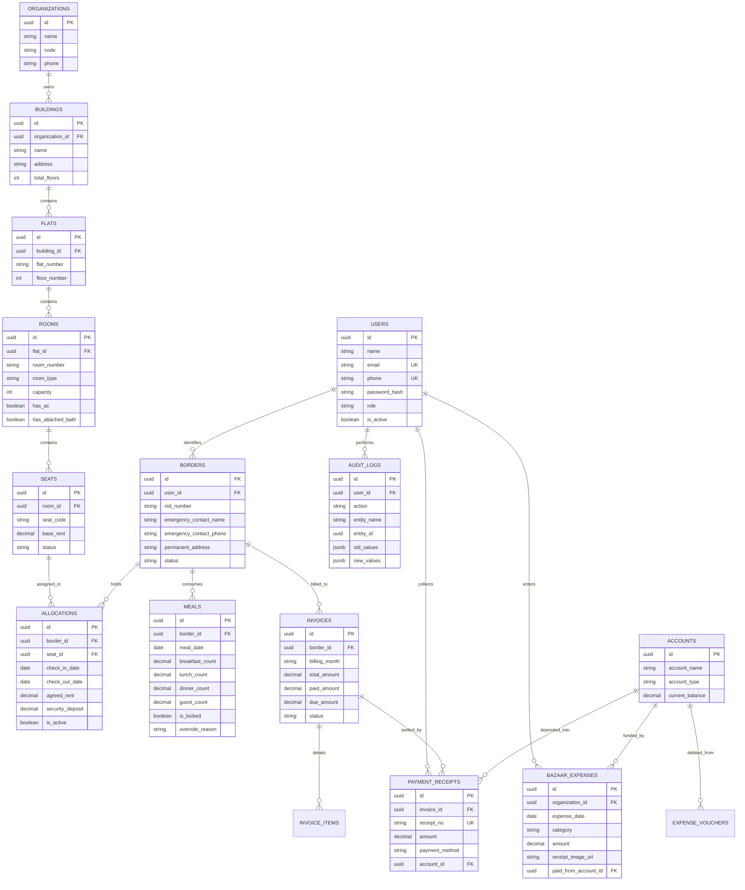

# Database Design & Schema Specifications (DDS)
## Project Name: Bachelor Home Hostel ERP (ব্যাচেলর হোম হোস্টেল ইআরপি)
**Document Version:** 1.0.0  
**Status:** Approved for Implementation Phase  
**Base References:** [prd.md](file:///c:/Users/MTBD/Documents/Bachelor%20Home%20ERP/prd.md) | [system_architecture.md](file:///c:/Users/MTBD/Documents/Bachelor%20Home%20ERP/system_architecture.md)  
**Target Engines:** PostgreSQL 15+ (Production) | SQLite 3 (Dev/Edge) | Google Sheets (Sync Mode)  

---

## 1. Database Overview & Design Standards

### 1.1 Character Encoding & Timezone Standards
- **Character Set & Collation:** `UTF-8` (`en_US.UTF-8` or `bn_BD.UTF-8`) to support Bengali text natively (বর্ডার নাম, স্থায়ী ঠিকানা, খরচের বিবরণী).
- **Timezone:** All timestamps stored with timezone (`TIMESTAMPTZ`), normalized to `Asia/Dhaka` (UTC+6).
- **Primary Keys:** `UUIDv4` or auto-incrementing `BIGSERIAL` (UUID recommended for distributed safety, `BIGSERIAL` supported for lightweight deployments).
- **Monetary Precision:** `DECIMAL(12, 2)` or `NUMERIC(12, 2)` for all financial amounts (Bangladeshi Taka). Never use floating point.

### 1.2 Table Naming & Convention
- Table names are lowercase and plural (`buildings`, `seats`, `borders`, `meals`).
- Foreign keys use `<singular_entity>_id` syntax (e.g., `building_id`, `border_id`).
- Audit columns present on all major entities: `created_at`, `updated_at`, `created_by`.

---

## 2. Complete Entity Relationship Diagram (ERD)



---

## 3. Data Dictionary & Detailed DDL (PostgreSQL / SQLite Compatible)

### 3.1 Organization & Authentication Tables

#### 3.1.1 `organizations`
Represents the hostel enterprise or mess entity (supports multi-branch setups).
```sql
CREATE TABLE organizations (
    id UUID PRIMARY KEY DEFAULT gen_random_uuid(),
    name VARCHAR(150) NOT NULL,
    code VARCHAR(50) UNIQUE NOT NULL,
    contact_phone VARCHAR(20) NOT NULL,
    contact_email VARCHAR(100),
    address TEXT,
    currency VARCHAR(10) DEFAULT 'BDT',
    is_active BOOLEAN DEFAULT TRUE,
    created_at TIMESTAMPTZ DEFAULT CURRENT_TIMESTAMP,
    updated_at TIMESTAMPTZ DEFAULT CURRENT_TIMESTAMP
);
```

#### 3.1.2 `users`
System accounts across all roles (`SUPER_ADMIN`, `ADMIN`, `MANAGER`, `ACCOUNTANT`, `STAFF`, `BORDER`).
```sql
CREATE TYPE user_role_enum AS ENUM ('SUPER_ADMIN', 'ADMIN', 'MANAGER', 'ACCOUNTANT', 'STAFF', 'BORDER');

CREATE TABLE users (
    id UUID PRIMARY KEY DEFAULT gen_random_uuid(),
    organization_id UUID NOT NULL REFERENCES organizations(id) ON DELETE CASCADE,
    name VARCHAR(120) NOT NULL,
    phone VARCHAR(20) UNIQUE NOT NULL,
    email VARCHAR(120) UNIQUE,
    password_hash VARCHAR(255) NOT NULL,
    role user_role_enum NOT NULL DEFAULT 'BORDER',
    avatar_url TEXT,
    preferred_language VARCHAR(5) DEFAULT 'bn' CHECK (preferred_language IN ('bn', 'en')),
    is_active BOOLEAN DEFAULT TRUE,
    last_login_at TIMESTAMPTZ,
    created_at TIMESTAMPTZ DEFAULT CURRENT_TIMESTAMP,
    updated_at TIMESTAMPTZ DEFAULT CURRENT_TIMESTAMP
);

CREATE INDEX idx_users_phone ON users(phone);
CREATE INDEX idx_users_org_role ON users(organization_id, role);
```

---

### 3.2 Property Hierarchy Tables (Building $\rightarrow$ Flat $\rightarrow$ Room $\rightarrow$ Seat)

#### 3.2.1 `buildings`
```sql
CREATE TABLE buildings (
    id UUID PRIMARY KEY DEFAULT gen_random_uuid(),
    organization_id UUID NOT NULL REFERENCES organizations(id) ON DELETE CASCADE,
    name VARCHAR(100) NOT NULL,
    code VARCHAR(30) NOT NULL,
    address TEXT NOT NULL,
    caretaker_name VARCHAR(100),
    caretaker_phone VARCHAR(20),
    total_floors INT NOT NULL DEFAULT 1,
    is_active BOOLEAN DEFAULT TRUE,
    created_at TIMESTAMPTZ DEFAULT CURRENT_TIMESTAMP,
    updated_at TIMESTAMPTZ DEFAULT CURRENT_TIMESTAMP,
    UNIQUE(organization_id, code)
);
```

#### 3.2.2 `flats`
```sql
CREATE TABLE flats (
    id UUID PRIMARY KEY DEFAULT gen_random_uuid(),
    building_id UUID NOT NULL REFERENCES buildings(id) ON DELETE CASCADE,
    flat_number VARCHAR(30) NOT NULL, -- e.g., '3-A', 'Flat 402'
    floor_number INT NOT NULL,
    has_kitchen BOOLEAN DEFAULT TRUE,
    has_dining BOOLEAN DEFAULT TRUE,
    electric_meter_no VARCHAR(50),
    notes TEXT,
    created_at TIMESTAMPTZ DEFAULT CURRENT_TIMESTAMP,
    updated_at TIMESTAMPTZ DEFAULT CURRENT_TIMESTAMP,
    UNIQUE(building_id, flat_number)
);
```

#### 3.2.3 `rooms`
```sql
CREATE TYPE room_category_enum AS ENUM ('SINGLE', 'DOUBLE', 'TRIPLE', 'FOUR_SHARED', 'DORMITORY');

CREATE TABLE rooms (
    id UUID PRIMARY KEY DEFAULT gen_random_uuid(),
    flat_id UUID NOT NULL REFERENCES flats(id) ON DELETE CASCADE,
    room_number VARCHAR(30) NOT NULL, -- e.g., '301', 'Room 2'
    category room_category_enum NOT NULL DEFAULT 'DOUBLE',
    capacity INT NOT NULL CHECK (capacity > 0),
    has_ac BOOLEAN DEFAULT FALSE,
    has_attached_bath BOOLEAN DEFAULT FALSE,
    has_balcony BOOLEAN DEFAULT FALSE,
    created_at TIMESTAMPTZ DEFAULT CURRENT_TIMESTAMP,
    updated_at TIMESTAMPTZ DEFAULT CURRENT_TIMESTAMP,
    UNIQUE(flat_id, room_number)
);
```

#### 3.2.4 `seats`
```sql
CREATE TYPE seat_status_enum AS ENUM ('AVAILABLE', 'BOOKED', 'OCCUPIED', 'MAINTENANCE');

CREATE TABLE seats (
    id UUID PRIMARY KEY DEFAULT gen_random_uuid(),
    room_id UUID NOT NULL REFERENCES rooms(id) ON DELETE CASCADE,
    seat_code VARCHAR(50) UNIQUE NOT NULL, -- e.g., 'B1-F3A-R301-S1'
    label VARCHAR(50) NOT NULL,            -- e.g., 'Window Side Bed 1'
    base_rent DECIMAL(10, 2) NOT NULL CHECK (base_rent >= 0),
    status seat_status_enum NOT NULL DEFAULT 'AVAILABLE',
    notes TEXT,
    created_at TIMESTAMPTZ DEFAULT CURRENT_TIMESTAMP,
    updated_at TIMESTAMPTZ DEFAULT CURRENT_TIMESTAMP
);

CREATE INDEX idx_seats_room_status ON seats(room_id, status);
```

---

### 3.3 Border (Resident) & Allocation Tables

#### 3.3.1 `borders`
Resident identity, KYC documents, and emergency profiles.
```sql
CREATE TYPE border_status_enum AS ENUM ('ACTIVE', 'NOTICE_GIVEN', 'INACTIVE');

CREATE TABLE borders (
    id UUID PRIMARY KEY DEFAULT gen_random_uuid(),
    user_id UUID UNIQUE NOT NULL REFERENCES users(id) ON DELETE CASCADE,
    nid_number VARCHAR(50) NOT NULL,
    passport_or_student_id VARCHAR(50),
    nid_document_url TEXT,
    photo_url TEXT,
    blood_group VARCHAR(5),
    date_of_birth DATE,
    institution_or_workplace VARCHAR(150),
    designation VARCHAR(100),
    permanent_address TEXT NOT NULL,
    emergency_contact_name VARCHAR(120) NOT NULL,
    emergency_contact_relation VARCHAR(50) NOT NULL, -- e.g., 'বাবা', 'মা', 'ভাই'
    emergency_contact_phone VARCHAR(20) NOT NULL,
    status border_status_enum NOT NULL DEFAULT 'ACTIVE',
    created_at TIMESTAMPTZ DEFAULT CURRENT_TIMESTAMP,
    updated_at TIMESTAMPTZ DEFAULT CURRENT_TIMESTAMP
);

CREATE INDEX idx_borders_nid ON borders(nid_number);
CREATE INDEX idx_borders_status ON borders(status);
```

#### 3.3.2 `allocations`
Tracks the complete seat assignment history (Check-in, agreed rent, deposit, check-out).
```sql
CREATE TABLE allocations (
    id UUID PRIMARY KEY DEFAULT gen_random_uuid(),
    border_id UUID NOT NULL REFERENCES borders(id) ON DELETE RESTRICT,
    seat_id UUID NOT NULL REFERENCES seats(id) ON DELETE RESTRICT,
    check_in_date DATE NOT NULL,
    check_out_date DATE,
    agreed_rent DECIMAL(10, 2) NOT NULL CHECK (agreed_rent >= 0),
    security_deposit DECIMAL(10, 2) NOT NULL DEFAULT 0.00 CHECK (security_deposit >= 0),
    deposit_refunded DECIMAL(10, 2) DEFAULT 0.00,
    is_active BOOLEAN NOT NULL DEFAULT TRUE,
    checkout_reason TEXT,
    created_by UUID REFERENCES users(id),
    created_at TIMESTAMPTZ DEFAULT CURRENT_TIMESTAMP,
    updated_at TIMESTAMPTZ DEFAULT CURRENT_TIMESTAMP
);

CREATE INDEX idx_allocations_active ON allocations(border_id, seat_id, is_active);
```

---

### 3.4 Meal Management & Cutoff Tables

#### 3.4.1 `meals`
Stores daily meal consumption points per border with cutoff lock flags.
```sql
CREATE TABLE meals (
    id UUID PRIMARY KEY DEFAULT gen_random_uuid(),
    border_id UUID NOT NULL REFERENCES borders(id) ON DELETE CASCADE,
    meal_date DATE NOT NULL,
    breakfast_count DECIMAL(4, 2) NOT NULL DEFAULT 1.00 CHECK (breakfast_count >= 0),
    lunch_count DECIMAL(4, 2) NOT NULL DEFAULT 1.00 CHECK (lunch_count >= 0),
    dinner_count DECIMAL(4, 2) NOT NULL DEFAULT 1.00 CHECK (dinner_count >= 0),
    guest_breakfast DECIMAL(4, 2) NOT NULL DEFAULT 0.00 CHECK (guest_breakfast >= 0),
    guest_lunch DECIMAL(4, 2) NOT NULL DEFAULT 0.00 CHECK (guest_lunch >= 0),
    guest_dinner DECIMAL(4, 2) NOT NULL DEFAULT 0.00 CHECK (guest_dinner >= 0),
    total_meal_units DECIMAL(6, 2) GENERATED ALWAYS AS (
        breakfast_count + lunch_count + dinner_count + 
        guest_breakfast + guest_lunch + guest_dinner
    ) STORED,
    is_locked BOOLEAN NOT NULL DEFAULT FALSE,
    locked_at TIMESTAMPTZ,
    is_overridden BOOLEAN NOT NULL DEFAULT FALSE,
    override_by_user_id UUID REFERENCES users(id),
    override_reason TEXT,
    created_at TIMESTAMPTZ DEFAULT CURRENT_TIMESTAMP,
    updated_at TIMESTAMPTZ DEFAULT CURRENT_TIMESTAMP,
    UNIQUE(border_id, meal_date)
);

-- Fast Index for 31-day meal grid lookup and date aggregations
CREATE INDEX idx_meals_date_lookup ON meals(meal_date, is_locked);
CREATE INDEX idx_meals_border_matrix ON meals(border_id, meal_date);
```

#### 3.4.2 `bazaar_expenses`
Tracks daily groceries, meat, fish, and mess procurement vouchers.
```sql
CREATE TABLE bazaar_expenses (
    id UUID PRIMARY KEY DEFAULT gen_random_uuid(),
    organization_id UUID NOT NULL REFERENCES organizations(id) ON DELETE CASCADE,
    building_id UUID REFERENCES buildings(id) ON DELETE SET NULL,
    expense_date DATE NOT NULL,
    category VARCHAR(50) NOT NULL, -- e.g., 'মাছ ও মাংস', 'শাকসবজি', 'চাল ও তেল', 'মসলা', 'গ্যাস সিলিন্ডার'
    item_description TEXT NOT NULL,
    amount DECIMAL(10, 2) NOT NULL CHECK (amount > 0),
    voucher_receipt_url TEXT,
    purchased_by_user_id UUID REFERENCES users(id),
    paid_from_account_id UUID REFERENCES accounts(id),
    approved_by_user_id UUID REFERENCES users(id),
    created_at TIMESTAMPTZ DEFAULT CURRENT_TIMESTAMP,
    updated_at TIMESTAMPTZ DEFAULT CURRENT_TIMESTAMP
);

CREATE INDEX idx_bazaar_expenses_date ON bazaar_expenses(organization_id, expense_date);
```

#### 3.4.3 `monthly_meal_rates`
Caches the calculated meal rate per billing period to prevent rate mutation after settlement.
```sql
CREATE TABLE monthly_meal_rates (
    id UUID PRIMARY KEY DEFAULT gen_random_uuid(),
    organization_id UUID NOT NULL REFERENCES organizations(id) ON DELETE CASCADE,
    billing_month VARCHAR(7) NOT NULL, -- Format: 'YYYY-MM' (e.g. '2026-10')
    total_bazaar_cost DECIMAL(12, 2) NOT NULL,
    total_consumed_meals DECIMAL(10, 2) NOT NULL,
    calculated_meal_rate DECIMAL(8, 4) NOT NULL,
    is_closed BOOLEAN NOT NULL DEFAULT FALSE,
    closed_at TIMESTAMPTZ,
    closed_by_user_id UUID REFERENCES users(id),
    created_at TIMESTAMPTZ DEFAULT CURRENT_TIMESTAMP,
    UNIQUE(organization_id, billing_month)
);
```

---

### 3.5 Financial & Billing Tables

#### 3.5.1 `accounts`
Stores cash drawers, bank accounts, and mobile financial services (bKash/Nagad).
```sql
CREATE TYPE account_type_enum AS ENUM ('CASH', 'BANK', 'BKASH', 'NAGAD', 'ROCKET');

CREATE TABLE accounts (
    id UUID PRIMARY KEY DEFAULT gen_random_uuid(),
    organization_id UUID NOT NULL REFERENCES organizations(id) ON DELETE CASCADE,
    account_name VARCHAR(100) NOT NULL, -- e.g., 'Hostel Cash Box', 'bKash Merchant'
    account_type account_type_enum NOT NULL DEFAULT 'CASH',
    account_number VARCHAR(50),
    current_balance DECIMAL(12, 2) NOT NULL DEFAULT 0.00,
    is_active BOOLEAN DEFAULT TRUE,
    created_at TIMESTAMPTZ DEFAULT CURRENT_TIMESTAMP,
    updated_at TIMESTAMPTZ DEFAULT CURRENT_TIMESTAMP
);
```

#### 3.5.2 `invoices`
Monthly consolidated resident statements.
```sql
CREATE TYPE invoice_status_enum AS ENUM ('DRAFT', 'UNPAID', 'PARTIALLY_PAID', 'PAID', 'VOID');

CREATE TABLE invoices (
    id UUID PRIMARY KEY DEFAULT gen_random_uuid(),
    border_id UUID NOT NULL REFERENCES borders(id) ON DELETE RESTRICT,
    invoice_number VARCHAR(50) UNIQUE NOT NULL, -- e.g., 'INV-202610-0012'
    billing_month VARCHAR(7) NOT NULL,          -- 'YYYY-MM'
    issue_date DATE NOT NULL,
    due_date DATE NOT NULL,
    subtotal_rent DECIMAL(10, 2) NOT NULL DEFAULT 0.00,
    subtotal_meal DECIMAL(10, 2) NOT NULL DEFAULT 0.00,
    subtotal_utilities DECIMAL(10, 2) NOT NULL DEFAULT 0.00,
    previous_due DECIMAL(10, 2) NOT NULL DEFAULT 0.00,
    late_fine DECIMAL(10, 2) NOT NULL DEFAULT 0.00,
    total_amount DECIMAL(10, 2) NOT NULL CHECK (total_amount >= 0),
    paid_amount DECIMAL(10, 2) NOT NULL DEFAULT 0.00 CHECK (paid_amount >= 0),
    due_amount DECIMAL(10, 2) GENERATED ALWAYS AS (total_amount - paid_amount) STORED,
    status invoice_status_enum NOT NULL DEFAULT 'UNPAID',
    created_by UUID REFERENCES users(id),
    created_at TIMESTAMPTZ DEFAULT CURRENT_TIMESTAMP,
    updated_at TIMESTAMPTZ DEFAULT CURRENT_TIMESTAMP
);

CREATE INDEX idx_invoices_border_month ON invoices(border_id, billing_month);
CREATE INDEX idx_invoices_status ON invoices(status);
```

#### 3.5.3 `invoice_items`
Itemized lines inside an invoice.
```sql
CREATE TABLE invoice_items (
    id UUID PRIMARY KEY DEFAULT gen_random_uuid(),
    invoice_id UUID NOT NULL REFERENCES invoices(id) ON DELETE CASCADE,
    item_type VARCHAR(50) NOT NULL, -- 'SEAT_RENT', 'MEAL_BILL', 'ELECTRICITY', 'WIFI', 'GAS', 'MAID_SALARY', 'LATE_FINE'
    description VARCHAR(200) NOT NULL,
    unit_price DECIMAL(10, 2) NOT NULL,
    quantity DECIMAL(8, 2) NOT NULL DEFAULT 1.00,
    total_price DECIMAL(10, 2) NOT NULL,
    created_at TIMESTAMPTZ DEFAULT CURRENT_TIMESTAMP
);
```

#### 3.5.4 `payment_receipts`
Money receipts for payments collected.
```sql
CREATE TABLE payment_receipts (
    id UUID PRIMARY KEY DEFAULT gen_random_uuid(),
    invoice_id UUID REFERENCES invoices(id) ON DELETE SET NULL,
    border_id UUID NOT NULL REFERENCES borders(id) ON DELETE RESTRICT,
    account_id UUID NOT NULL REFERENCES accounts(id) ON DELETE RESTRICT,
    receipt_no VARCHAR(50) UNIQUE NOT NULL, -- e.g., 'MR-202610-0089'
    amount DECIMAL(10, 2) NOT NULL CHECK (amount > 0),
    payment_method VARCHAR(30) NOT NULL,    -- 'CASH', 'BKASH', 'NAGAD', 'BANK'
    transaction_ref VARCHAR(100),           -- TrxID
    notes TEXT,
    collected_by UUID NOT NULL REFERENCES users(id),
    received_at TIMESTAMPTZ DEFAULT CURRENT_TIMESTAMP,
    created_at TIMESTAMPTZ DEFAULT CURRENT_TIMESTAMP
);

CREATE INDEX idx_receipts_border ON payment_receipts(border_id);
CREATE INDEX idx_receipts_number ON payment_receipts(receipt_no);
```

---

### 3.6 Audit Trail & System Log Table

#### 3.6.1 `audit_logs`
Immutable logging table. No updates or deletes allowed.
```sql
CREATE TABLE audit_logs (
    id UUID PRIMARY KEY DEFAULT gen_random_uuid(),
    user_id UUID REFERENCES users(id) ON DELETE SET NULL,
    action VARCHAR(80) NOT NULL,           -- e.g., 'MEAL_LOCK_TRIGGER', 'POST_10PM_OVERRIDE', 'PAYMENT_COLLECTED'
    entity_name VARCHAR(50) NOT NULL,      -- e.g., 'meals', 'invoices', 'allocations'
    entity_id UUID,
    old_values JSONB,
    new_values JSONB,
    ip_address VARCHAR(45),
    user_agent TEXT,
    created_at TIMESTAMPTZ DEFAULT CURRENT_TIMESTAMP NOT NULL
);

CREATE INDEX idx_audit_logs_action ON audit_logs(action);
CREATE INDEX idx_audit_logs_entity ON audit_logs(entity_name, entity_id);
CREATE INDEX idx_audit_logs_created ON audit_logs(created_at);
```

---

## 4. Database Triggers & Business Logic Invariants

### 4.1 Automatic Seat Status Sync on Allocation
When an allocation is created or ended, the seat status automatically transitions:
```sql
CREATE OR REPLACE FUNCTION sync_seat_status_on_allocation()
RETURNS TRIGGER AS $$
BEGIN
    IF (TG_OP = 'INSERT' AND NEW.is_active = TRUE) THEN
        UPDATE seats SET status = 'OCCUPIED' WHERE id = NEW.seat_id;
    ELSIF (TG_OP = 'UPDATE') THEN
        IF (OLD.is_active = TRUE AND NEW.is_active = FALSE) THEN
            UPDATE seats SET status = 'AVAILABLE' WHERE id = NEW.seat_id;
        END IF;
    END IF;
    RETURN NEW;
END;
$$ LANGUAGE plpgsql;

CREATE TRIGGER trg_sync_seat_status
AFTER INSERT OR UPDATE ON allocations
FOR EACH ROW EXECUTE FUNCTION sync_seat_status_on_allocation();
```

### 4.2 Account Balance Auto-Update on Payment Collection
When a `payment_receipt` is created, the receiving account balance is debited automatically:
```sql
CREATE OR REPLACE FUNCTION update_account_balance_on_payment()
RETURNS TRIGGER AS $$
BEGIN
    UPDATE accounts 
    SET current_balance = current_balance + NEW.amount,
        updated_at = CURRENT_TIMESTAMP
    WHERE id = NEW.account_id;
    
    -- Also update invoice paid_amount & status if attached
    IF NEW.invoice_id IS NOT NULL THEN
        UPDATE invoices
        SET paid_amount = paid_amount + NEW.amount,
            status = CASE 
                WHEN (paid_amount + NEW.amount) >= total_amount THEN 'PAID'::invoice_status_enum
                ELSE 'PARTIALLY_PAID'::invoice_status_enum
            END,
            updated_at = CURRENT_TIMESTAMP
        WHERE id = NEW.invoice_id;
    END IF;

    RETURN NEW;
END;
$$ LANGUAGE plpgsql;

CREATE TRIGGER trg_update_account_balance
AFTER INSERT ON payment_receipts
FOR EACH ROW EXECUTE FUNCTION update_account_balance_on_payment();
```

---

## 5. Seed Data (Realistic Bangladesh Bachelor Mess Context)

```sql
-- 1. Insert Organization
INSERT INTO organizations (id, name, code, contact_phone, address)
VALUES ('a0000000-0000-0000-0000-000000000001', 'Bachelor Home Hostels BD', 'BHH-DHAKA', '01711000000', 'Mirpur-10, Dhaka-1216');

-- 2. Insert Super Admin & Manager
INSERT INTO users (id, organization_id, name, phone, email, password_hash, role, preferred_language)
VALUES 
('b0000000-0000-0000-0000-000000000001', 'a0000000-0000-0000-0000-000000000001', 'Super Administrator', '01700000001', 'admin@bachelorhome.com', '$2b$12$e8YkZ8cM0s...', 'SUPER_ADMIN', 'bn'),
('b0000000-0000-0000-0000-000000000002', 'a0000000-0000-0000-0000-000000000001', 'Md. Rafiqul Islam (Manager)', '01700000002', 'rafiq@bachelorhome.com', '$2b$12$e8YkZ8cM0s...', 'MANAGER', 'bn');

-- 3. Insert Building, Flat, Room & Seats
INSERT INTO buildings (id, organization_id, name, code, address, total_floors)
VALUES ('c0000000-0000-0000-0000-000000000001', 'a0000000-0000-0000-0000-000000000001', 'Green View Building', 'BLD-1', 'House #12, Road #4, Mirpur-10', 5);

INSERT INTO flats (id, building_id, flat_number, floor_number)
VALUES ('d0000000-0000-0000-0000-000000000001', 'c0000000-0000-0000-0000-000000000001', 'Flat 3-A', 3);

INSERT INTO rooms (id, flat_id, room_number, category, capacity, has_ac, has_attached_bath)
VALUES ('e0000000-0000-0000-0000-000000000001', 'd0000000-0000-0000-0000-000000000001', 'Room 301', 'DOUBLE', 2, FALSE, TRUE);

INSERT INTO seats (id, room_id, seat_code, label, base_rent, status)
VALUES 
('f0000000-0000-0000-0000-000000000001', 'e0000000-0000-0000-0000-000000000001', 'B1-F3A-R301-S1', 'Window Side Bed', 3500.00, 'AVAILABLE'),
('f0000000-0000-0000-0000-000000000002', 'e0000000-0000-0000-0000-000000000001', 'B1-F3A-R301-S2', 'Door Side Bed', 3200.00, 'AVAILABLE');

-- 4. Insert Accounts
INSERT INTO accounts (id, organization_id, account_name, account_type, current_balance)
VALUES 
('a1111111-0000-0000-0000-000000000001', 'a0000000-0000-0000-0000-000000000001', 'Hostel Cash Box', 'CASH', 15000.00),
('a1111111-0000-0000-0000-000000000002', 'a0000000-0000-0000-0000-000000000001', 'bKash Merchant 01711...', 'BKASH', 42500.00);
```

---

## 6. Google Sheets Tabular Mapping (Alternative / Hybrid Mode)

If deployed using Google Sheets as a storage engine (as noted in the blueprint), relational tables map directly to Sheets tabs:

| Google Sheet Tab | Equivalent SQL Table | Primary Columns |
| :--- | :--- | :--- |
| `01_Buildings` | `buildings` | `ID`, `Name`, `Code`, `Address`, `Total Floors` |
| `02_Flats` | `flats` | `ID`, `Building_ID`, `Flat_No`, `Floor` |
| `03_Rooms` | `rooms` | `ID`, `Flat_ID`, `Room_No`, `Type`, `Capacity`, `AC` |
| `04_Seats` | `seats` | `ID`, `Room_ID`, `Seat_Code`, `Label`, `Base_Rent`, `Status` |
| `05_Borders` | `borders` + `users` | `ID`, `Name`, `Phone`, `NID`, `Emergency_Phone`, `Status` |
| `06_Allocations`| `allocations` | `ID`, `Border_ID`, `Seat_ID`, `CheckIn_Date`, `Rent`, `Deposit` |
| `07_Daily_Meals`| `meals` | `Date`, `Border_ID`, `Breakfast`, `Lunch`, `Dinner`, `Guest`, `Locked` |
| `08_Bazaar` | `bazaar_expenses` | `Date`, `Category`, `Amount`, `Description`, `Entered_By` |
| `09_Invoices` | `invoices` | `Invoice_No`, `Border_ID`, `Month`, `Total`, `Paid`, `Due`, `Status` |
| `10_Receipts` | `payment_receipts` | `Receipt_No`, `Border_ID`, `Amount`, `Method`, `TrxID`, `Date` |
| `11_Audit_Logs` | `audit_logs` | `Timestamp`, `User_ID`, `Action`, `Details` |

---

## 7. Next Steps in Architecture Execution

With `prd.md`, `system_architecture.md`, and `database_design.md` complete, the remaining specifications to complete the blueprint are:
1. **`api_specifications.md`** — RESTful OpenAPI route contracts, payloads, and status codes.
2. **`ui_ux_architecture.md`** — Bilingual component structure, design system, and screen specifications.
