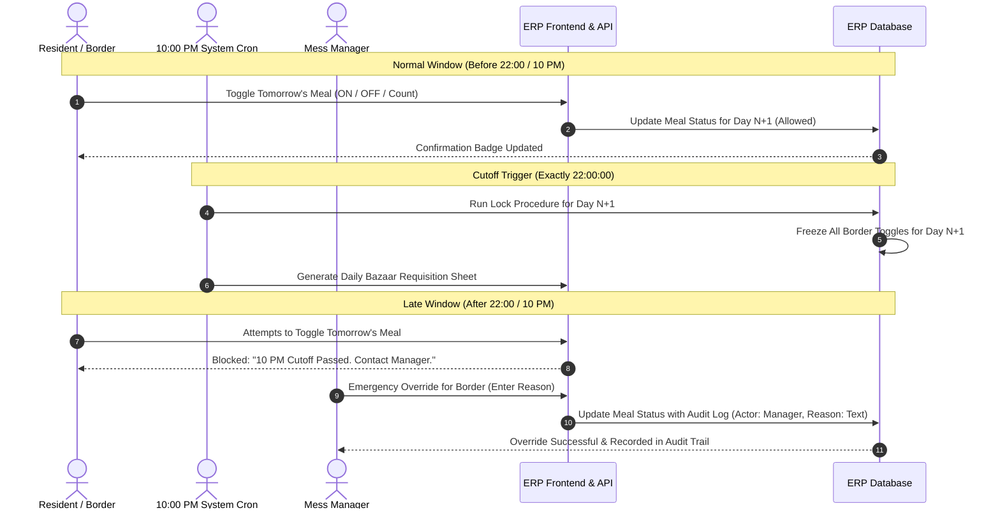
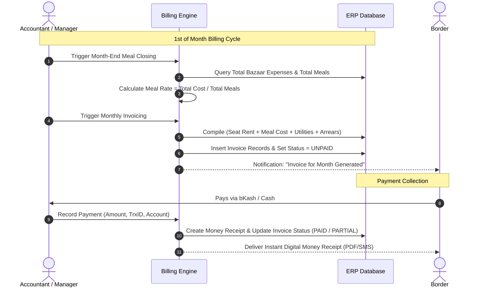
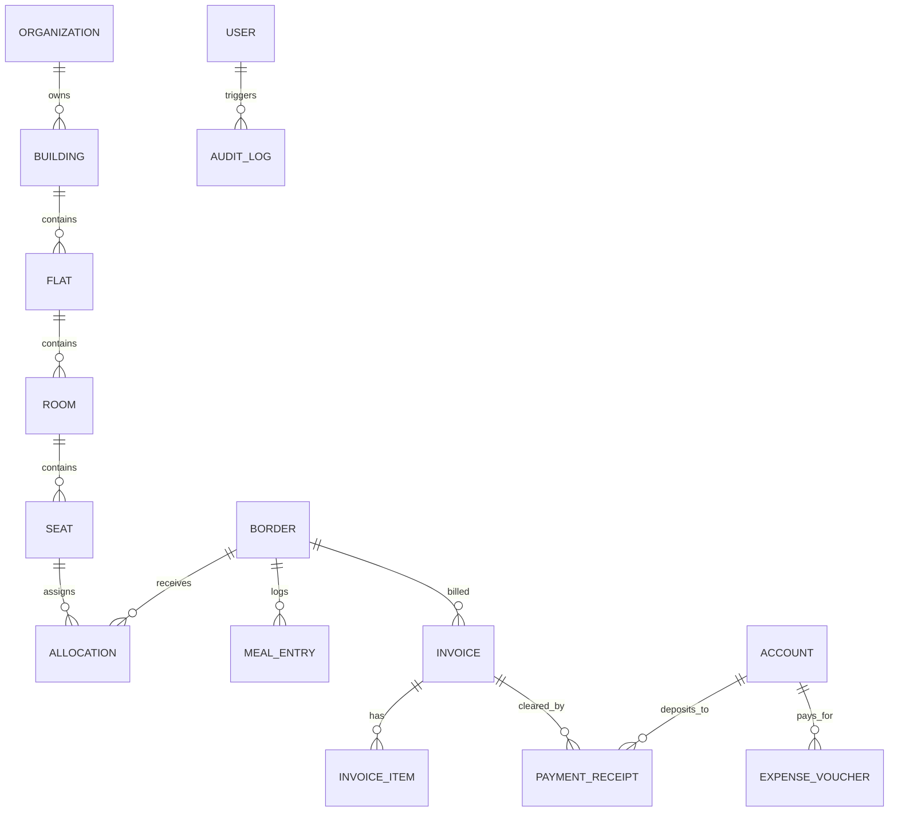

# Product Requirements Document (PRD)
## Project Name: Bachelor Home Hostel ERP (ব্যাচেলর হোম হোস্টেল ইআরপি)
**Document Version:** 1.0.0  
**Status:** Approved for Architecture Phase  
**Last Updated:** October 2026  
**Target Audience:** System Architects, Software Engineers, UI/UX Designers, Hostel Owners & Operators  

---

## 1. Executive Summary & Vision

### 1.1 Project Overview
**Bachelor Home Hostel ERP** is an all-in-one web-based Enterprise Resource Planning (ERP) platform tailored specifically for bachelor hostels, student dormitories, mess facilities, and shared living houses. It streamlines end-to-end hostel operations including property hierarchy, resident (border) onboarding, dynamic bed/seat allocation, daily meal management with a strict 10:00 PM cutoff engine, automated rent and utility billing, multi-channel payment reconciliation, and granular financial reporting.

### 1.2 Core Problem Statement
Managing bachelor hostels and shared messes in South Asian contexts (particularly Bangladesh) currently suffers from:
1. **Manual & Error-Prone Meal Calculation:** Disputes over daily meal counts (সকালের নাস্তা, দুপুরের খাবার, রাতের খাবার), guest meals, and fluctuating monthly meal rates (মিল রেট).
2. **Cutoff Violations:** Borders turning off meals late, resulting in food waste or excess bazaar expenditure, causing mess manager conflicts.
3. **Complex Expense & Bazaar Reconciliation:** Daily bazaar expenses, gas, rice bulk purchases, and shared spice funds are tracked in messy paper khatas (খাতা) without audit trails.
4. **Rent & Utility Collection Bottlenecks:** Tracking advance security deposits, variable electricity bills (prepaid card vs. postpaid sub-meter), WiFi, cook/maid salaries, and arrears across hundreds of borders.
5. **Lack of Transparency & Audit:** Borders cannot inspect their live ledger or meal logs, leading to mistrust at the end of each month.

### 1.3 Key Product Goals
- **100% Digital Transparency:** Real-time border ledger, daily meal matrix, and automated expense-sharing calculation.
- **Strict Business Rule Enforcement:** Automated 10:00 PM meal locking rule to streamline daily grocery budgeting.
- **Hierarchical Asset Tracking:** Instant real-time visibility into Building → Flat → Room → Seat vacancy.
- **Bilingual Interface:** First-class support for Bengali (বাংলা) and English (EN) with localized terminologies (বর্ডার, মেস, সিট, মিল রেট, জমা, বকেয়া).
- **Scalable Architecture-Ready Foundation:** Clean API-ready specifications suitable for modular web backends (Node.js/Go/Python/PHP) and structured relational/document databases or Google Sheets backend connectors.

---

## 2. User Roles & Permissions Matrix (RBAC)

The system enforces granular Role-Based Access Control (RBAC).

### 2.1 Role Definitions
| Role | Code | Description |
| :--- | :--- | :--- |
| **Super Admin** | `SUPER_ADMIN` | System proprietor/owner. Full access across all hostel branches/buildings, configuration, users, and audit logs. |
| **Admin** | `ADMIN` | Hostel branch general manager. Oversees full operations, finance, borders, approvals, and report generations. |
| **Manager** | `MANAGER` | Daily operational manager. Manages check-in/out, daily bazaar entry, meal overrides, and collection entries. |
| **Accountant** | `ACCOUNTANT` | Financial officer. Manages rent invoicing, payment receipts, expense approvals, ledger reconciliations, and P&L statements. |
| **Staff / Cook** | `STAFF` | Caretaker/Cook/Kitchen assistant. Read-only meal sheet for kitchen cooking counts, maintenance ticket updates. |
| **Border (Resident)**| `BORDER` | Tenant/Resident. Self-service portal to view seat info, toggle next day meals (before 10 PM), view ledger, download receipts, and raise issues. |

### 2.2 Permissions Matrix
| Module / Action | Super Admin | Admin | Manager | Accountant | Staff | Border |
| :--- | :---: | :---: | :---: | :---: | :---: | :---: |
| **Manage Buildings / Flats / Rooms / Seats** | CRUD | CRUD | Read | Read | Read | - |
| **Border KYC & Onboarding** | CRUD | CRUD | CRUD | Read | - | View Own Profile |
| **Seat Allocation & Transfer** | CRUD | CRUD | CRUD | Read | - | View Own Seat |
| **Daily Meal Status Toggle** | Full Override | Full Override | Full Override (with log) | - | - | Toggle Own (Before 10 PM) |
| **Daily Meal View & Matrix** | View All | View All | View All | View All | View Counts | View Own History |
| **Bazaar & Mess Expense Entry** | CRUD | CRUD | CRUD | Review/CRUD | Read | View Shared Summary |
| **Monthly Bill Generation** | Run/Approve | Run/Approve | - | Run/Approve | - | - |
| **Rent & Payment Collection** | CRUD | CRUD | Create/Read | CRUD | - | View Own Receipts |
| **Voucher / Expense Management** | CRUD | CRUD | Create/Read | CRUD | - | - |
| **Reports (P&L, Occupancy, Defaulters)** | Full | Full | Operational | Financial | - | Own Statement Only |
| **Audit Log Inspection** | Full | View | - | - | - | - |

---

## 3. Detailed Functional Modules & Requirements

### 3.1 Module 1: Property & Asset Hierarchy Management
Manages physical housing infrastructure in a structured 4-tier tree hierarchy:
$$\text{Building} \longrightarrow \text{Flat / Unit} \longrightarrow \text{Room} \longrightarrow \text{Seat (Bed)}$$

#### 3.1.1 Hierarchy Attributes
- **Building (ভবন):** Name/Number, Branch Code, Address, Caretaker Contact, Total Floors, Utility Meter IDs.
- **Flat / Unit (ফ্ল্যাট):** Flat No/Label (e.g., 3-A, 4-B), Floor Level, Kitchen Availability, Balcony, Attached Meter info.
- **Room (রুম):** Room Number/Tag (e.g., Room-301), Room Category (`SINGLE`, `DOUBLE`, `TRIPLE`, `FOUR_PLUS_SHARED`, `MASTER_BED`), Attached Bathroom (`YES`/`NO`), Balcony (`YES`/`NO`), AC Availability (`AC`/`NON_AC`).
- **Seat / Bed (সিট):** Unique Seat Code (e.g., `BLD1-F3A-R301-S1`), Seat Identifier (Window side, Door side, Upper bunk, Lower bunk), Standard Base Rent (টাকা), Status (`AVAILABLE`, `BOOKED`, `OCCUPIED`, `MAINTENANCE`).

#### 3.1.2 Business Rules & Validations
- A Room cannot exceed its designated maximum seat capacity.
- Deleting a Building/Flat/Room is blocked if active occupied seats or unresolved financial balances are linked.
- Seat status transitions:
  - `AVAILABLE` $\rightarrow$ `BOOKED` (Upon initial advance/booking token)
  - `BOOKED` or `AVAILABLE` $\rightarrow$ `OCCUPIED` (Upon formal border check-in allocation)
  - `OCCUPIED` $\rightarrow$ `MAINTENANCE` or `AVAILABLE` (Upon final checkout clearance)

---

### 3.2 Module 2: Border (Resident) KYC & Onboarding
Maintains detailed profiles and legal identification for each resident.

#### 3.2.1 Data Points
- **Personal Information:** Full Name (English & Bangla), Mobile Number (Primary, SMS-enabled), Alternate Number, Email, Date of Birth, Blood Group.
- **Identity Proof (KYC):** National ID (NID / Smart Card No.), Passport No., or University/College Student ID, Uploaded Scans (NID front/back, Passport photo).
- **Emergency Contact:** Guardian Name, Relation (বাবা, মা, ভাই, চাচা, অভিভাবক), Phone Number, Address.
- **Professional / Educational Profile:** Institution / Organization Name, Designation / Department, ID card copy.
- **Permanent Address:** Village/Road, Post Office, Upazila/Thana, District (জেলা), Division.
- **Mess Preferences:** Default Meal Policy (`ALWAYS_ON`, `DEFAULT_OFF`), Dietary Restrictions, Blood Group.

#### 3.2.2 Business Rules
- NID or Valid ID attachment is compulsory for check-in confirmation.
- Phone number must be unique in active borders.
- Emergency contact number cannot be identical to the border's personal number.

---

### 3.3 Module 3: Seat Allocation & Resident Lifecycle

#### 3.3.1 Check-In & Allocation Workflow
1. Manager selects an `AVAILABLE` or `BOOKED` seat.
2. Manager selects or creates a Border profile.
3. Allocation details recorded:
   - Check-in Date (বরাদ্দ তারিখ).
   - Agreed Monthly Rent (মাসিক ভাড়া).
   - Security Deposit Amount (ফেরতযোগ্য জামানত).
   - Advance Rent Paid (if any).
4. System automatically switches Seat status to `OCCUPIED`.
5. An initial Welcome Money Receipt & Deposit Voucher are generated in the financial ledger.

#### 3.3.2 Seat Transfer / Room Swap
- Allows moving a border from `Seat A` to `Seat B` within the same or different flat/building.
- Automatically adjusts rent differential from the effective transfer date.
- Maintains a historical audit log of previous room/seat occupancy.

#### 3.3.3 Notice & Check-Out (রিলিজ / সিট ত্যাগ) Workflow
1. **Notice Submission:** Border submits 30-day prior notice (e.g., leaving at month end). System flags seat as `LEAVING_SOON`.
2. **Clearance Calculation (Final Bill Reconciliation):**
   $$\text{Final Balance} = \text{Unpaid Prior Rent} + \text{Current Month Prorated Rent} + \text{Unbilled Meal Charges} + \text{Utility Shares} - \text{Security Deposit}$$
3. **Settlement:**
   - If Balance $> 0$: Border must pay the outstanding amount before exit clearance.
   - If Balance $< 0$: Hostel refunds the remaining security deposit.
4. **Checkout Finalization:** Seat transitions to `AVAILABLE` or `MAINTENANCE`. Border profile archived to `FORMER_BORDER`.

---

### 3.4 Module 4: Meal Management Engine (মেস মিল ম্যানেজমেন্ট)
The meal management module is the critical core of hostel life, eliminating daily friction between borders and managers.

#### 3.4.1 Meal Types & Units
- **Standard Meals:**
  - Breakfast (সকালের নাস্তা) – Default 0.5 or 1 unit.
  - Lunch (দুপুরের খাবার) – Default 1 unit.
  - Dinner (রাতের খাবার) – Default 1 unit.
- **Guest Meals (মেহমান মিল):** Borders can order additional meals for visitors with a designated multiplier or flat rate.
- **Custom Units:** Supports fractional units ($0.0, 0.5, 1.0, 1.5, 2.0$) per meal type.

#### 3.4.2 The 10:00 PM Strict Cutoff Rule (১০টা লক রুল)
- **Cutoff Time:** Every night at **22:00:00 (10:00 PM)** local time.
- **Border Privilege:** Borders can freely turn ON/OFF or adjust their meal units for Tomorrow (Day $N+1$) up until 22:00:00 tonight.
- **Auto-Lock:** At 22:00:01, the system hard-locks tomorrow's meal roster.
- **Post-10 PM Overrides:**
  - Borders cannot modify locked meal statuses.
  - Only `MANAGER` or `ADMIN` can override locked meals.
  - Every post-10 PM manual override requires an **Audit Reason** (e.g., "Emergency arrival approved by owner") and records the manager's user ID and timestamp.
- **Automated Morning Kitchen Sheet:** At 22:05:00, the system aggregates total headcounts for Breakfast, Lunch, and Dinner for Day $N+1$ so the cook/manager knows exact bazaar quantities required early morning.

#### 3.4.3 Daily Bazaar & Mess Expense Tracking
- **Bazaar Entry:** Date, Item Category (চাল, মাছ, মাংস, ডিম, শাকসবজি, মশলা, তেল, গ্যাস সিলিন্ডার), Total Amount (টাকা), Paid By (Hostel Cash / Manager / Border volunteer), Uploaded Memo/Cash Voucher.
- **Common Mess Expenses:** Cook salary (বাবুর্চির বেতন), dishwashing liquid, kerosene/gas, shared kitchen maintenance.

#### 3.4.4 Dynamic Meal Rate Calculation Formula
The meal rate can be computed dynamically daily or closed monthly:
$$\text{Period Meal Rate (প্রতি মিল রেট)} = \frac{\text{Total Period Bazaar Expenses} + \text{Kitchen Operational Overheads}}{\text{Total Consumed Meals (Active Borders + Guest Meals)}}$$

$$\text{Border Individual Meal Cost} = (\text{Total Individual Consumed Meals}) \times \text{Meal Rate} + \text{Special Guest Charges}$$

#### 3.4.5 Meal Closing & Monthly Settlement
- At month end, manager locks the bazaar expenses and meal counts.
- System calculates the final Meal Rate and pushes the individual meal charges directly into the border's monthly billing ledger.

#### 3.4.6 Border Self-Service Mobile Application & PWA (বর্ডার মোবাইল অ্যাপ)
- **Standalone Mobile Web App / PWA:** Borders can access the portal via mobile browser and install it to their home screen as a native-like app.
- **Self-Service Meal Toggle:** 
  - Borders can toggle their tomorrow's meals (Breakfast, Lunch, Dinner, Guest Meals) freely until 10:00:00 PM tonight.
  - Live 10 PM countdown timer is prominently displayed.
  - Hard lock enforcement after 10 PM with instructions to contact the mess manager.
- **Personal Information & Profile Hub:**
  - Displays resident's name, phone, photo, room number, seat code, bed side, agreement rent, security deposit held, check-in date, and emergency guardian contacts.
- **Live Digital Ledger & Statement:**
  - View current month's consumed meal points, estimated meal charges, seat rent, and utility shares.
  - Paid vs Due balance display with digital Money Receipt (MR-XXXX) lookup.
- **Daily Mess Menu & Notice Board:**
  - Live display of today's kitchen menu (Breakfast, Lunch, Dinner).
  - Mess announcements & emergency repair notices.
- **Digital Complaint & Maintenance Box:**
  - Borders can raise maintenance issues (fan, light, plumbing, WiFi) directly to the mess manager.

---

### 3.5 Module 5: Financial Accounting, Rent & Billing
Complete billing engine supporting recurring invoices, utility splits, and double-entry/ledger accounting.

#### 3.5.1 Monthly Invoicing Cycle (Generated on 1st of each month)
Each border invoice contains itemized heads:
1. **Seat Base Rent (সিট ভাড়া):** Fixed monthly agreed seat rent.
2. **Meal Bill (মিল খরচ):** Actual calculated meal bill or monthly food advance.
3. **Utility & Shared Services:**
   - Electricity (বিদ্যুৎ বিল): Sub-meter actual units $\times$ unit rate, or flat shared split.
   - Gas (গ্যাস বিল): Pre-agreed flat share or LPG cylinder split.
   - Water & Waste (পানি ও ময়লা বিল): Fixed monthly amount.
   - High-speed Internet / WiFi (ওয়াইফাই বিল).
   - Housekeeper / Maid / Cook Salary (খালা / বাবুর্চির বেতন).
4. **Late Fine / Surcharge:** Configurable grace period (e.g., payment due by 10th of the month; 100 BDT fine thereafter).
5. **Previous Balance / Arrears (পূর্বের বকেয়া):** Unpaid dues from previous cycle.
6. **Credit Balance:** Overpayments from previous cycle deducted.

#### 3.5.2 Payment Collection & Receipts (টাকা গ্রহণ ও মানি রসিদ)
- **Accepted Modes:** Cash (নগদ), bKash, Nagad, Rocket, Bank Transfer, Upay.
- **Transaction Details:** Amount, Date, Payment Method, TrxID / Reference, Received By.
- **Instant Money Receipt:**
  - Auto-generated serial number (e.g., `MR-202610-0042`).
  - Printable PDF / thermal receipt.
  - Optional SMS/Email receipt notification.
- **Partial Payments:** Supports multi-step payments; recalculates remaining due in real-time.

#### 3.5.3 Expense Management & Cashbook
- **Operational Expense Categories:**
  - House Rent paid to Landlord (বাড়িওয়ালাকে বাড়ি ভাড়া).
  - Electricity & Utility Bill payments to utility providers (DESCO, DPDC, WASA, Titas).
  - Staff Salaries (Manager, Security, Cleaner, Cook).
  - Maintenance & Repairs (Plumbing, Electrical, Carpentry, Paint).
  - Internet & Cable bills.
- **Accounts / Cash Drawers:**
  - Cash-in-Hand (ক্যাশ বক্স).
  - bKash Merchant / Personal Account.
  - Bank Current / Savings Account.
- **Fund Transfer:** Transfer between cash and bank accounts with dual-entry audit.

---

### 3.6 Module 6: Reporting & Business Intelligence Analytics

#### 3.6.1 Required Reports
1. **Occupancy & Bed Matrix Report:**
   - Real-time seat occupancy percentage per building/flat.
   - Vacant seats categorized by pricing and room types.
   - Border turnover (New admissions vs Releases in period).
2. **Monthly Collection & Due Report (বকেয়া রিপোর্ট):**
   - Summary of total billed vs total collected vs total outstanding dues.
   - Defaulter list with aging breakdown (1-10 days, 11-20 days, 21+ days).
3. **Monthly 31-Day Meal Matrix Sheet (মিল শিট):**
   - Grid showing all borders along rows, days 1 to 31 along columns, showing daily breakfast/lunch/dinner/guest meal points and total individual sum.
   - Printable and Excel/CSV exportable.
4. **Bazaar Expense & Meal Rate Analysis:**
   - Daily bazaar expense chart vs meal headcount.
   - Trend analysis of meal rate fluctuation throughout the month.
5. **Profit & Loss (P&L) Statement:**
   - Total Income (Rent + Utilities + Overheads + Fines).
   - Total Operating Expenses (Landlord rent + Utilities + Staff salaries + Repairs).
   - Net Operating Margin.
6. **Individual Border Ledger Statement (বর্ডার খতিয়ান):**
   - Complete historical timeline for a border: Every invoice debited, every receipt credited, and ongoing net balance.

---

### 3.7 Module 7: Security, Audit Logging & Compliance

#### 3.7.1 Security Architecture Requirements
- **Authentication:** Secure Token-based session management (JWT / Secure Cookie), bcrypt/Argon2 password hashing.
- **RBAC Enforcement:** Middleware-level permission checking on every API endpoint.
- **Data Isolation:** Organization-level tenant isolation if multi-hostel is enabled.
- **Sensitive KYC Protection:** Secured storage of NID scans and personal data.

#### 3.7.2 Immutable Audit Trail
Every critical action creates an audit log entry:
- **Timestamp:** ISO 8601 UTC + Local Bangladesh Time (+06:00).
- **Actor:** User ID, Name, Role, IP Address, User-Agent.
- **Event Type:** `MEAL_OVERRIDE_AFTER_10PM`, `RENT_COLLECTION_SAVED`, `SEAT_ALLOCATION_CHANGED`, `EXPENSE_APPROVED`, `INVOICE_VOIDED`.
- **Payload:** Diff of Previous Value $\rightarrow$ New Value.
- **Audit Logs are Read-Only:** Even Super Admin cannot edit or delete audit records.

---

### 3.8 Module 8: Bilingual User Experience (বাংলা ও ইংরেজি UI/UX)

#### 3.8.1 Localization Standards
- Seamless language switcher in top navigation: `[ EN | বাংলা ]`.
- All forms, labels, status badges, buttons, notifications, and generated invoices must support both languages.
- Numbers and Currency: Formatting for Bangladeshi Taka (৳ / BDT), English (1,234.50) and Bengali numerals (১,২৩৪.৫০).
- Date Pickers: Gregorian calendar with localized Bengali month names (জানুয়ারি, ফেব্রুয়ারি, ...).

#### 3.8.2 UI Components & Aesthetics
- **Design Language:** Modern, clean, dashboard-first design (Inter / Outfit font for English, Hind Siliguri / Noto Sans Bengali for Bangla).
- **Color Coding for Seat Status:**
  - 🟢 Green: `Available (খালি)`
  - 🔴 Red: `Occupied (বরাদ্দকৃত)`
  - 🟡 Amber: `Reserved / Booked (বুকড)`
  - ⚪ Grey/Slate: `Under Maintenance (মেরামত)`
- **Mobile First Quick Actions:**
  - Daily quick meal toggle sheet for manager with single-tap switch.
  - Border mobile dashboard with simple 1-click "Turn Tomorrow's Meal ON/OFF" button before 10 PM.

---

## 4. System Workflows & Sequence Diagrams

### 4.1 Daily Meal & Cutoff Lifecycle Workflow


---

### 4.2 Monthly Billing & Reconciliation Cycle


---

## 5. High-Level Data Model & Entity Relationships

The data model is structured for relational integrity (PostgreSQL/MySQL) and can map to Google Sheets tabs or MongoDB collections.

### 5.1 Core Entities Summary


### 5.2 Key Data Entities & Attributes
1. **`users`:** `id`, `name`, `email`, `phone`, `password_hash`, `role` (`SUPER_ADMIN`, `ADMIN`, `MANAGER`, `ACCOUNTANT`, `STAFF`, `BORDER`), `is_active`, `created_at`.
2. **`buildings`:** `id`, `name`, `code`, `address`, `total_floors`, `created_at`.
3. **`flats`:** `id`, `building_id`, `flat_number`, `floor`, `utility_meters`.
4. **`rooms`:** `id`, `flat_id`, `room_number`, `room_type`, `has_ac`, `has_attached_bath`.
5. **`seats`:** `id`, `room_id`, `seat_code`, `base_rent`, `status` (`AVAILABLE`, `BOOKED`, `OCCUPIED`, `MAINTENANCE`).
6. **`borders`:** `id`, `user_id`, `nid_number`, `emergency_contact_name`, `emergency_contact_phone`, `institution_work`, `permanent_address`, `status` (`ACTIVE`, `LEAVING`, `INACTIVE`).
7. **`allocations`:** `id`, `border_id`, `seat_id`, `check_in_date`, `check_out_date`, `agreed_rent`, `security_deposit_paid`, `is_active`.
8. **`meals`:** `id`, `border_id`, `date`, `breakfast_count`, `lunch_count`, `dinner_count`, `guest_breakfast`, `guest_lunch`, `guest_dinner`, `is_locked`, `override_by_user_id`, `override_reason`.
9. **`bazaar_expenses`:** `id`, `date`, `category`, `amount`, `receipt_image_url`, `notes`, `created_by_user_id`.
10. **`invoices`:** `id`, `border_id`, `billing_month`, `total_amount`, `paid_amount`, `due_amount`, `status` (`PAID`, `PARTIAL`, `UNPAID`), `due_date`.
11. **`payment_receipts`:** `id`, `invoice_id`, `receipt_no`, `amount`, `payment_method`, `account_id`, `transaction_reference`, `collected_by_user_id`, `created_at`.
12. **`audit_logs`:** `id`, `user_id`, `action`, `entity_type`, `entity_id`, `old_values_json`, `new_values_json`, `ip_address`, `created_at`.

---

## 6. Non-Functional Requirements (NFR)

### 6.1 Performance & Scalability
- **Response Time:** API endpoint latency $< 300\text{ ms}$ for standard queries; $< 1000\text{ ms}$ for heavy 31-day meal grid aggregations.
- **Concurrency:** Support minimum 500 concurrent active borders submitting meal toggles between 21:00 and 22:00 without database deadlocks.
- **Offline Tolerance / Low Bandwidth:** Lightweight frontend bundles optimized for mobile 3G/4G network speeds typical in Bangladesh.

### 6.2 Reliability & Availability
- **High Availability:** 99.9% uptime target.
- **Cron Precision:** The 10:00 PM cutoff automated job must execute within $\pm 2$ seconds of 22:00:00 local time.
- **Automated Backups:** Daily automated database backup with 30-day retention and point-in-time recovery.

### 6.3 Compliance & Localization
- **Timezone:** Asia/Dhaka (UTC+6) hardcoded as the business logic master timezone.
- **Currency:** BDT (৳ - Bangladeshi Taka) as standard default.
- **Bengali Typography:** Proper rendering of Bengali conjunct characters (যুক্তাক্ষর) in generated PDF reports and receipts.

---

## 7. Roadmap & Step-by-Step Architecture Preparation

This PRD serves as the master contract. The subsequent technical specifications will be built according to the following phased roadmap:

```
[Phase 1: PRD Completion] (Current)
        │
        ▼
[Phase 2: System Architecture Design]
  ├── Tech Stack Evaluation (Next.js / Node.js vs Python vs Apps Script backend)
  ├── System Context & Container Diagrams (C4 Model)
  └── Clean Architecture / Layered Design (Controller, Service, Repository)
        │
        ▼
[Phase 3: Database & ERD Specification]
  ├── Complete SQL Schemas & Table DDLs
  ├── Foreign Key Relationships & Indexes
  └── Google Sheets Tabular Schema Mapping (Alternative Lightweight Backend)
        │
        ▼
[Phase 4: API Contract & Business Logic Specifications]
  ├── OpenAPI / Swagger Specification
  ├── 10 PM Cron Lock Engine Algorithm
  └── Dynamic Meal Rate Calculation & Invoicing Pipeline
        │
        ▼
[Phase 5: UI/UX & Component Architecture]
  ├── Design Tokens (Tailored Colors, Typography, Spacing)
  ├── Bilingual i18n Translation Dictionary Structure
  └── Screen Wireframes (Dashboard, 31-Day Meal Grid, Seat Matrix, Receipts)
```

---

## 8. Glossary of Terms (শব্দকোষ)
- **বর্ডার (Border):** The resident or tenant staying in a hostel seat/room.
- **মেস (Mess):** Shared housing where members cooperatively manage meals and household expenses.
- **সিট (Seat / Bed):** An individual bed allocated to a border inside a shared room.
- **মিল রেট (Meal Rate):** Calculated ratio of total grocery/bazaar expenses divided by total meals consumed.
- **বাজার খরচ (Bazaar Expense):** Day-to-day procurement cost for food ingredients (fish, meat, vegetables, rice, oil, spices).
- **১০টা লক রুল (10 PM Cutoff Rule):** Strict daily deadline after which borders cannot alter their food schedule for the following day.
- **খালা / বাবুর্চি (Maid / Cook):** The staff responsible for cleaning and preparing daily mess meals.
- **খতিয়ান (Ledger Statement):** The comprehensive running financial history of a resident or the hostel account.
