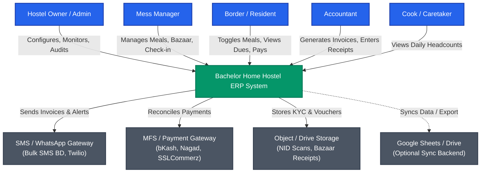
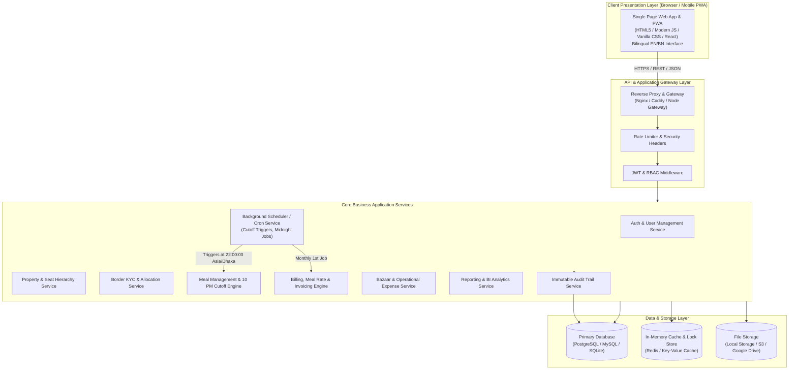
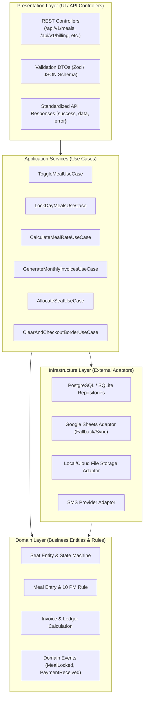
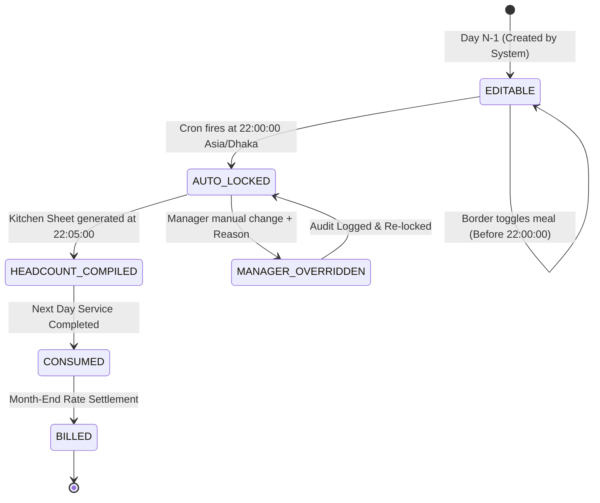
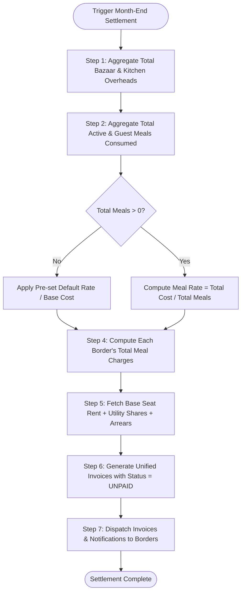
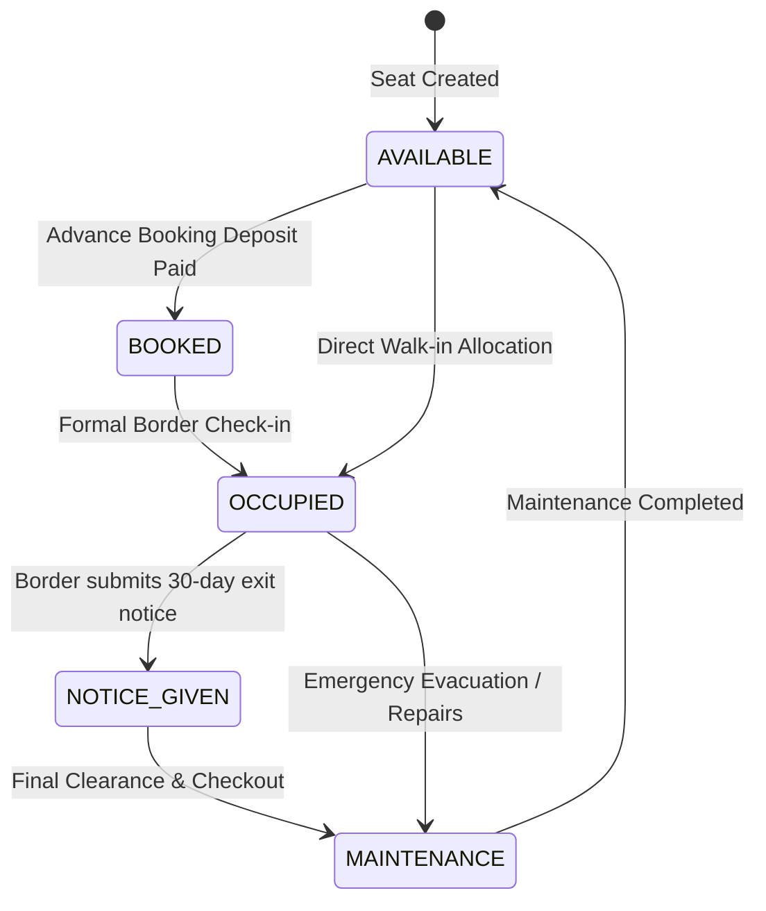
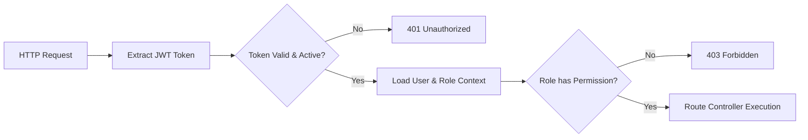

# System Architecture Document (SAD)
## Project Name: Bachelor Home Hostel ERP (ব্যাচেলর হোম হোস্টেল ইআরপি)
**Document Version:** 1.0.0  
**Status:** Approved for Implementation Phase  
**Base Reference:** [prd.md](file:///c:/Users/MTBD/Documents/Bachelor%20Home%20ERP/prd.md)  
**Target Audience:** Lead Architects, Backend & Frontend Developers, DevOps Engineers, QA Engineers  

---

## 1. Architecture Overview & Core Objectives

### 1.1 Architectural Vision
The **Bachelor Home Hostel ERP** system architecture is designed following **Clean Architecture (Hexagonal Architecture)** and **Domain-Driven Design (DDD)** principles. It guarantees high availability, real-time data consistency, strict temporal rule enforcement (10:00 PM Cutoff), tamper-evident audit trails, and seamless bilingual responsiveness across mobile and desktop devices.

### 1.2 Core Architectural Principles
1. **Separation of Concerns:** Strict decoupling of UI (Presentation), Business Logic (Domain & Application Services), and Data Access (Infrastructure/Persistence).
2. **Deterministic Temporal Consistency:** The 10:00 PM Meal Cutoff Engine operates strictly in `Asia/Dhaka` (UTC+6) time with automated locks and transactional integrity.
3. **Auditability by Design:** Financial vouchers, seat allocations, and meal overrides are append-only and immutable.
4. **Hybrid Persistence Capability:** Standard Relational Database (PostgreSQL/SQLite) with an optional Google Sheets Connector Service to allow two-way sync or lightweight deployment as outlined in the blueprint.
5. **Mobile-First Responsiveness:** Low-latency API design with payload compression for mobile networks.

---

## 2. System Context & C4 Architecture Model

### 2.1 C4 Level 1: System Context Diagram
Shows how the Bachelor Home Hostel ERP interacts with external actors and third-party systems.



---

### 2.2 C4 Level 2: Container Diagram
Decomposes the ERP system into high-level runnable containers/services.



---

## 3. Layered Component Architecture (Clean Architecture)



---

## 4. Subsystem Deep-Dive & Core Technical Engines

### 4.1 The 10:00 PM Meal Cutoff & State Machine Engine
The meal cutoff is a critical system boundary requiring atomic state transitions and concurrency safeguards.

#### 4.1.1 State Machine Lifecycle


#### 4.1.2 Concurrency & Timezone Locking Protocol
- **Authoritative Clock:** The server clock must be synchronized with NTP; timestamps are evaluated against the `Asia/Dhaka` timezone offset (`+06:00`).
- **Pessimistic / Optimistic Check:**
  ```javascript
  function assertMealEditable(targetDate, serverTime) {
      const cutoffTime = getCutoffDateTime(targetDate); // 22:00:00 of (targetDate - 1 day) in Asia/Dhaka
      if (serverTime >= cutoffTime) {
          throw new BusinessRuleViolationException(
              "CUTOFF_EXCEEDED", 
              "Meal modifications for tomorrow closed at 10:00 PM. Contact manager."
          );
      }
  }
  ```
- **Cron Architecture:**
  - Standard cron job: `0 22 * * *` (Runs every night at 22:00:00).
  - Executes batch SQL statement:
    ```sql
    UPDATE meals 
    SET is_locked = true, locked_at = NOW() 
    WHERE meal_date = CURRENT_DATE + INTERVAL '1 day' 
      AND is_locked = false;
    ```
  - Emits event: `EventBus.emit('MEALS_LOCKED_FOR_DATE', { date: tomorrow })`.
  - Aggregator listener generates morning bazaar headcount:
    $$\text{Breakfast Count} = \sum \text{breakfast\_count}$$
    $$\text{Lunch Count} = \sum \text{lunch\_count}$$
    $$\text{Dinner Count} = \sum \text{dinner\_count}$$

---

### 4.2 Dynamic Meal Rate & Month-End Invoicing Engine

#### 4.2.1 Calculation Pipeline


#### 4.2.2 Mathematical Specifications
1. **Total Period Mess Expenditure ($E_{\text{mess}}$):**
   $$E_{\text{mess}} = \sum_{i=1}^{k} \text{BazaarExpense}_i + \sum_{j=1}^{m} \text{KitchenOverhead}_j$$
2. **Total Consumed Meal Units ($M_{\text{total}}$):**
   $$M_{\text{total}} = \sum_{\text{border}} (M_{\text{breakfast}} \times w_b + M_{\text{lunch}} \times w_l + M_{\text{dinner}} \times w_d) + M_{\text{guest}}$$
   *(where $w_b, w_l, w_d$ are customizable unit weights, e.g., $0.5, 1.0, 1.0$ or $1, 1, 1$)*
3. **Period Unit Meal Rate ($R_{\text{meal}}$):**
   $$R_{\text{meal}} = \frac{E_{\text{mess}}}{M_{\text{total}}}$$
4. **Individual Resident Total Invoice ($I_{\text{border}}$):**
   $$I_{\text{border}} = \text{SeatRent} + (M_{\text{border\_consumed}} \times R_{\text{meal}}) + U_{\text{electricity}} + U_{\text{gas}} + U_{\text{wifi}} + U_{\text{maid}} + \text{Arrears} - \text{AdvanceCredit}$$

---

### 4.3 Property & Seat Allocation State Engine
Seats follow a deterministic transition lifecycle to prevent double-booking:



---

## 5. Security & Authentication Architecture

### 5.1 Authentication Flow
- **Protocol:** Stateless JSON Web Token (JWT) with HMAC-SHA256 or RSA-256 signing.
- **Token Strategy:**
  - `Access Token`: 15-minute validity, stored in memory or Secure, HttpOnly, SameSite=Lax cookie.
  - `Refresh Token`: 7-day validity, persisted in database with token-rotation to detect hijacking.
- **Passwords:** Hashed with `bcrypt` (cost factor 12) or `Argon2id`.

### 5.2 Granular RBAC Middleware Guard
Every incoming HTTP request traverses the security pipeline:



### 5.3 Tamper-Evident Audit Logging Subsystem
- Any mutation on financial accounts, seat allocations, or post-10 PM meal overrides invokes `AuditService.logEvent()`.
- **Audit Table Invariants:**
  - No `UPDATE` or `DELETE` permissions granted on `audit_logs` table (database-level rule).
  - Records: `id`, `user_id`, `role`, `action`, `resource`, `resource_id`, `before_state_json`, `after_state_json`, `ip_address`, `user_agent`, `created_at`.

---

## 6. Bilingual Architecture (i18n & Localization)

### 6.1 Locale Management Architecture
- **Supported Locales:** `bn` (Bangla - Primary Default), `en` (English).
- **Resolution Strategy:**
  1. User Preference in Database Profile (if logged in).
  2. LocalStorage Cache: `current_locale`.
  3. Browser `Accept-Language` header.
- **Dictionary Organization:**
  ```
  locales/
  ├── bn/
  │   ├── common.json        # বাটন, মেনু, স্ট্যাটাস
  │   ├── meals.json         # সকাল, দুপুর, রাত, মেহমান মিল, কাট-অফ
  │   ├── finance.json       # সিট ভাড়া, মানি রসিদ, বকেয়া, লেজার
  │   ├── property.json      # ভবন, ফ্ল্যাট, রুম, সিট
  │   └── errors.json        # সতর্কবার্তা ও ভ্যালিডেশন
  └── en/
      ├── common.json
      ├── meals.json
      ├── finance.json
      ├── property.json
      └── errors.json
  ```

### 6.2 Currency & Number Formatter
- Dedicated utility `formatCurrency(amount, locale)`:
  - `formatCurrency(1500, 'bn')` $\rightarrow$ `৳ ১,৫০০.০০`
  - `formatCurrency(1500, 'en')` $\rightarrow$ `BDT 1,500.00`
- Date formatting localized with Gregorian-Bengali calendar text.

---

## 7. Data Synchronization & Persistence Modes

The system supports two persistence modes to ensure compatibility with traditional databases and cloud spreadsheets:

### 7.1 Primary Mode: Relational SQL Engine (Recommended)
- **Database:** PostgreSQL 15+ (Production) / SQLite 3 (Local Development & Edge Testing).
- **ORM / Query Builder:** Prisma / Drizzle ORM / Kysely for type safety and clean migration scripts.
- **Indexing Strategy:**
  - Composite Index on `meals(border_id, meal_date)` for instantaneous 31-day meal grid reads.
  - Index on `allocations(seat_id, is_active)` for zero-conflict seat lookups.
  - Index on `invoices(border_id, billing_month, status)` for instant accounts reconciliation.

### 7.2 Secondary Mode: Google Sheets Connector (Blueprint Feature)
- Dedicated `GoogleSheetsSyncService` for operators who require Google Sheets as their primary/backup spreadsheet:
  - Uses Google Sheets API v4 with Service Account credentials.
  - Asynchronous background worker pushes daily meal totals and monthly invoices to pre-formatted spreadsheet tabs.

---

## 8. Directory & Project Structure

The project follows standard Clean Architecture / Modular Monolith conventions:

```
bachelor-home-erp/
├── docs/
│   ├── prd.md                           # Product Requirements Document
│   ├── system_architecture.md           # This Architecture Document
│   ├── database_design.md               # Detailed Schemas & DDL (Phase 3)
│   └── api_specifications.md            # REST API Specifications (Phase 4)
├── src/
│   ├── core/                            # Core domain rules & constants
│   │   ├── config/                      # Environment variables, constants
│   │   ├── errors/                      # Domain & HTTP errors
│   │   └── utils/                       # Date/Timezone, Currency, Hashers
│   ├── modules/                         # Feature Modules (Bounded Contexts)
│   │   ├── auth/                        # Login, JWT, Roles, Middleware
│   │   ├── property/                    # Building, Flat, Room, Seat
│   │   ├── border/                      # Border KYC, Profiles, Documents
│   │   ├── allocation/                  # Seat Allocation, Transfer, Release
│   │   ├── meal/                        # Meal Roster, 10 PM Cron, Cutoff Engine
│   │   ├── bazaar/                      # Daily Grocery Expense, Categories
│   │   ├── billing/                     # Invoices, Calculations, Due Ledger
│   │   ├── payment/                     # Money Receipts, MFS Reconcile
│   │   ├── reports/                     # P&L, Occupancy, 31-Day Matrix
│   │   └── audit/                       # Immutable Audit Logger
│   ├── infrastructure/                  # External connections
│   │   ├── database/                    # DB Client, Migrations, Seeds
│   │   ├── storage/                     # File upload handler (Local/S3)
│   │   ├── cron/                        # Scheduled workers (Node-cron / Bull)
│   │   └── notifications/               # SMS / WhatsApp / Email adaptors
│   ├── public/                          # Static assets, styles, icons
│   └── views/ or client/                # Bilingual Frontend SPA / SSR views
│       ├── locales/                     # bn.json & en.json
│       ├── components/                  # UI Design System components
│       └── pages/                       # Dashboard, Meal Grid, Billing, KYC
├── package.json
└── README.md
```

---

## 9. Technology Stack Recommendation

| Component | Recommended Stack | Rationale |
| :--- | :--- | :--- |
| **Frontend Framework** | **React / Next.js / Vanilla JS + Tailwind / CSS3** | Ultra-fast load times, responsive on mobile, rich modern aesthetics. |
| **Backend Runtime** | **Node.js (TypeScript / Express or Fastify)** | Event-driven, non-blocking I/O for heavy concurrent meal toggling. |
| **Primary Database** | **PostgreSQL (Prod) / SQLite (Dev)** | Relational integrity for financial ledgers and seat hierarchies. |
| **Scheduled Tasks (Cron)** | **Node-Cron / BullMQ (Redis-backed)** | Sub-second accuracy for the 10:00 PM cutoff trigger. |
| **Report Generation** | **Puppeteer / PDFKit & SheetJS (xlsx)** | Native Bengali typography rendering for PDF receipts & Excel export. |
| **Cloud / Hosting** | **Docker + VPS / Railway / Vercel** | Containerized, easily maintainable, horizontal scaling. |

---

## 10. Next Steps in Architecture Execution

With the PRD and System Architecture defined, the next immediate steps are:
1. **`database_design.md`** — Complete SQL Schemas, Table DDLs, foreign keys, cascade rules, and sample seed records.
2. **`api_specifications.md`** — Complete RESTful endpoint definitions, JSON payloads, status codes, and error models.
3. **`ui_ux_architecture.md`** — Frontend Component architecture, state tree, route maps, and bilingual design system.
