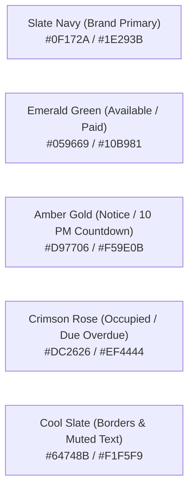
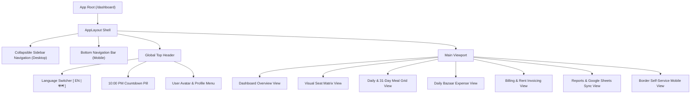
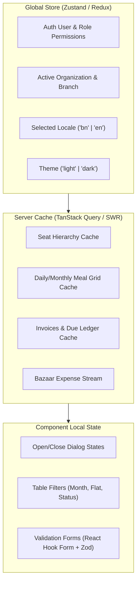

# UI/UX & Frontend Architecture Document
## Project Name: Bachelor Home Hostel ERP (ব্যাচেলর হোম হোস্টেল ইআরপি)
**Document Version:** 1.0.0  
**Status:** Approved for Implementation Phase  
**Base References:** [prd.md](file:///c:/Users/MTBD/Documents/Bachelor%20Home%20ERP/prd.md) | [system_architecture.md](file:///c:/Users/MTBD/Documents/Bachelor%20Home%20ERP/system_architecture.md) | [database_design.md](file:///c:/Users/MTBD/Documents/Bachelor%20Home%20ERP/database_design.md) | [api_specifications.md](file:///c:/Users/MTBD/Documents/Bachelor%20Home%20ERP/api_specifications.md)  
**Target Clients:** Responsive Web (Desktop, Tablet, Mobile PWA)  

---

## 1. Design Philosophy & Visual Design System

### 1.1 Aesthetic Vision
The UI delivers a **premium, clean, high-density ERP experience** tailored for both hostel administrative staff and mobile-first residents (borders). It eliminates cognitive fatigue through intuitive color-coding, clear typography, and instant feedback micro-interactions.

### 1.2 Color Palette & Semantic Design Tokens



| Token Name | Hex Code | Light Theme Usage | Dark Theme Usage | Semantic Role |
| :--- | :--- | :--- | :--- | :--- |
| `--color-primary` | `#1E293B` | Main Navigation, Titles | Card Backgrounds | Authority, Structure |
| `--color-primary-accent`| `#2563EB` | Active Tabs, CTA Buttons | Button Highlights | Interactive Elements |
| `--color-success` | `#10B981` | Available Seat, Paid Status | Available Seat Pill | Positive Cashflow / Vacant |
| `--color-danger` | `#EF4444` | Occupied Seat, Unpaid Due | Occupied Seat Pill | Locked / Occupied / Defaulter |
| `--color-warning` | `#F59E0B` | Reserved Seat, 10 PM Alert | Cutoff Countdown | Urgency / Pending Action |
| `--color-bg-canvas`| `#F8FAFC` | Page Background | `#0B0F19` | Surface Contrast |
| `--color-bg-card` | `#FFFFFF` | Container / Card Surfaces | `#1E293B` | Elevation Surface |
| `--color-border` | `#E2E8F0` | Dividers & Table Borders | `#334155` | Structural Grid |

### 1.3 Typography System
To render complex Bengali conjunct characters (যুক্তাক্ষর) alongside numbers and English terms cleanly:
- **English Font Family:** `Inter`, `Outfit`, system-ui, sans-serif
- **Bengali (বাংলা) Font Family:** `Hind Siliguri`, `Noto Sans Bengali`, sans-serif
- **Scale:**
  - `Display / H1`: `28px` (Bold, 700) – Page Titles & KPI Totals
  - `Heading / H2`: `20px` (Semi-bold, 600) – Section Headers, Card Titles
  - `Subheading / H3`: `16px` (Medium, 500) – Modal Headers, Table Columns
  - `Body / Normal`: `14px` (Regular, 400) – Table Data, Inputs, Descriptions
  - `Caption / Small`: `12px` (Medium, 500) – Badges, Timestamps, Helper Labels

---

## 2. Frontend Component Hierarchy & State Architecture

### 2.1 Component Architecture Tree


### 2.2 Client State Management Model


---

## 3. Screen Wireframes & UX Workflows

### 3.0 Screen 0: ERP Administrative Authentication (হোস্টেল ইআরপি লগইন)

```
+-------------------------------------------------------------+
|                     🏠 BACHELOR HOME ERP                    |
|                    হোস্টেল ইআরপি লগইন                       |
|           অ্যাডমিন, ম্যানেজার, অ্যাকাউন্ট্যান্ট ও স্টাফ প্যানেল          |
+-------------------------------------------------------------+
|                                                             |
|  ইউজার আইডি / মোবাইল নম্বর:                                |
|  [ 01700000002                                            ] |
|                                                             |
|  গোপন পাসওয়ার্ড:                                            |
|  [ **********                                             ] |
|                                                             |
|  [ 🔐 সিস্টেমে প্রবেশ করুন                                ] |
|                                                             |
|  ---------------------------------------------------------  |
|  ⚡ এক ক্লিকে ডেমো রোল টেস্ট করুন:                          |
|  [ 👑 সুপার অ্যাডমিন ] [ 📋 ম্যানেজার ] [ 💰 অ্যাকাউন্ট্যান্ট ] [ 🍳 স্টাফ ] |
|                                                             |
|  📲 আপনি কি বর্ডার? [বর্ডার মোবাইল পোর্টালে যান →]         |
+-------------------------------------------------------------+
```

### 3.1 Screen 1: Executive Dashboard (অ্যাডমিন ও ম্যানেজার ড্যাশবোর্ড)

```
+-----------------------------------------------------------------------------------------+
| [LOGO] Bachelor Home ERP       | ⏰ রাত ১০টা কাট-অফ বাকি: ০২ ঘ. ৪৫ মি. | [বাংলা] [🔔 3] [👤 রফিক] |
+-----------------------------------------------------------------------------------------+
| [📊 ওভারভিউ]  [🛏️ সিট ম্যাট্রিক্স]  [🍲 মিল খাতা]  [🛒 বাজার]  [💳 ভাড়া ও বিল]  [📈 রিপোর্ট]     |
+-----------------------------------------------------------------------------------------+
|                                                                                         |
|  [ 🛏️ মোট সিট: ৮০ ]     [ 🟢 খালি সিট: ৮ ]      [ 🍲 আজকের মোট মিল: ১২৪ ]   [ ⚠️ মোট বকেয়া: ৳ ৪৫,০০০ ] |
|  (অকুপেন্সি: ৯০%)      (বুকড: ২ টি)          (নাস্তা: ৩৬, দুপুর: ৪৪, রাত: ৪৪) (ডিফল্টার: ১২ জন)        |
|                                                                                         |
|  +--------------------------------------------+  +------------------------------------+ |
|  | ⚡ দ্রুত অ্যাকশন (Quick Actions)            |  | 🍲 আজকের সকালের বাজার রিকুইজিশন     | |
|  | [ + নতুন বর্ডার ভর্তি ]  [ + বাজার এন্ট্রি ]  |  | চাল: ১৮.৫ কেজি                      | |
|  | [ + ভাড়া আদায় ]        [ 📋 আজকের মিল শিট ] |  | মাছ/মাংস: ১২ কেজি                   | |
|  +--------------------------------------------+  | শাকসবজি ও মসলা: আনুমানিক ৳ ৮৫০       | |
|                                                  +------------------------------------+ |
|                                                                                         |
|  +------------------------------------------------------------------------------------+ |
|  | 📢 সাম্প্রতিক সতর্কতা ও অডিট নোটিশ                                                   | |
|  | • রাত ১০:১৫ - রুম ৩০১ এর বর্ডার তানভীরের রাতের খাবার ম্যানেজার কর্তৃক যুক্ত (কারণ সহ) | |
|  | • আজ সিট B1-F3A-R302-S1 এর মেয়াদ শেষ হচ্ছে (বর্ডার: শাকিল আহমেদ)                     | |
|  +------------------------------------------------------------------------------------+ |
+-----------------------------------------------------------------------------------------+
```

---

### 3.2 Screen 2: Visual Seat Grid & Occupancy Matrix (সিট বিন্যাস ও অকুপেন্সি)

```
ফিল্টার: [ ভবন: গ্রিন ভিউ ▼ ]  [ ফ্ল্যাট: ৩-এ ▼ ]  [ স্ট্যাটাস: সকল সিট ▼ ]    [ + নতুন সিট যুক্ত ]

================================== [ ফ্ল্যাট ৩-এ (৩য় তলা) ] ==================================

 [ রুম ৩০১ (২ সিট - এটাচড বাথ) ]               [ রুম ৩০২ (৩ সিট - নন-এসি) ]
 +---------------------------------------+     +---------------------------------------+
 | [🟢 খালি] B1-F3A-R301-S1 (জানালা)     |     | [🔴 বরাদ্দকৃত] B1-F3A-R302-S1 (সিট ১)  |
 | ভাড়া: ৳ ৩,৫০০                         |     | বর্ডার: তানভীর হাসান (01722334455)    |
 | [ + বর্ডার বরাদ্দ দিন ]                |     | ভাড়া: ৳ ৩,২০০ (বকেয়া: ৳ ০.০০)         |
 |---------------------------------------|     |---------------------------------------|
 | [🔴 বরাদ্দকৃত] B1-F3A-R301-S2 (দরজা)  |     | [🟡 বুকড] B1-F3A-R302-S2 (সিট ২)      |
 | বর্ডার: জাহিদুল ইসলাম (01811223344)   |     | অগ্রিম বুকিং: ৳ ১,০০০ (তারিখ: ১০ অক্টো)|
 | ভাড়া: ৳ ৩,২০০ (বকেয়া: ৳ ১,২০০)        |     |---------------------------------------|
 | [ বিস্তারিত দেখুন ] [ সিট বদল ]       |     | [⚪ মেরামত] B1-F3A-R302-S3 (ফ্যান সমস্যা)|
 +---------------------------------------+     +---------------------------------------+
```

---

### 3.3 Screen 3: 31-Day Complete Meal Sheet Matrix (৩১ দিনের মিল খাতা)

```
[ মাস: অক্টোবর ২০২৬ ▼ ]   [ ভবন: গ্রিন ভিউ ▼ ]   [ 📥 Excel ডাউনলোড ]   [ 🔄 গুগল শিট সিঙ্ক ]
স্ট্যাটাস: [ 🔒 রাত ১০টা লক সক্রিয় - আগামীকালের মিল ফ্রোজেন ]

+--------------------+------+------+------+------+------+------+------+-------+----------+
| বর্ডার নাম ও রুম   | ০১   | ০২   | ০৩   | ...  | ০৭   | ০৮(আগামী) | মোট মিল | মিল খরচ  |
+--------------------+------+------+------+------+------+------+------+-------+----------+
| তানভীর হাসান (৩০১) | ১|১|১| ১|১|১| ০|১|১| ...  | ১|১|১| [১|১|০]🔒| ৪২.৫  | ৳ ২,৬৪৫  |
| জাহিদুল ইসলাম (৩০১)| ০|১|১| ০|১|১| ০|১|১| ...  | ১|১|১| [১|১|১]🔒| ৩৮.০  | ৳ ২,৩৬৫  |
| রিয়াজ মোরশেদ (৩০২) | ১|১|১| ১|১|১| ১|১|১| ...  | ০|০|১| [০|০|০]🔒| ২৯.০  | ৳ ১,৮০৫  |
+--------------------+------+------+------+------+------+------+------+-------+----------+
| প্রতিদিনের মোট মিল | ৫৪.০ | ৫৬.৫ | ৪৮.০ | ...  | ৬২.০ |  ৫৮.৫ 🔒  | ১২৮০  | মোট খরচ: |
| বাজার খরচ (টাকা)   | ৩,২০০| ৩,৪৫০| ২,৯০০| ...  | ৩,৮০০|  ৩,৬০০    |       | ৳ ৭৯,৬০০ |
+--------------------+------+------+------+------+------+------+------+-------+----------+
( * ব্র্যাকেটে [নাস্তা | দুপুর | রাত] নির্দেশ করে )
```

#### ম্যানেজার ওভাররাইড ডায়ালগ (ম্যানেজার যদি রাত ১০টার পর পরিবর্তন করতে চান):
```
+--------------------------------------------------------------+
| ⚠️ জরুরি মিল পরিবর্তন (রাত ১০:০০ টার পর ওভাররাইড)              |
+--------------------------------------------------------------+
| বর্ডার: তানভীর হাসান (রুম ৩০১)                               |
| তারিখ: ০৮ অক্টোবর ২০২৬ (আগামীকাল)                            |
|                                                              |
| নাস্তা: [x] ১  [ ] ০      দুপুর: [x] ১  [ ] ০    রাত: [x] ১  [ ] ০ |
| মেহমান মিল: [ 0 ]                                            |
|                                                              |
| * পরিবর্তনের কারণ (অডিট ট্রেইলের জন্য বাধ্যতামূলক):           |
| [ বর্ডার জরুরি কাজে বাড়ি থেকে ফিরেছেন, মালিক অনুমোদিত...      ] |
|                                                              |
| [ বাতিল ]                                [ নিশ্চিত ও লগ করুন ] |
+--------------------------------------------------------------+
```

---

### 3.4 Screen 4: Rent Collection & Digital Money Receipt (ভাড়া আদায় ও মানি রসিদ)

```
+-------------------------------------------------------------------------------+
| 💳 ভাড়া ও মিল বিল আদায় (Payment Collection)                                    |
+-------------------------------------------------------------------------------+
| বর্ডার নির্বাচন: [ তানভীর হাসান - রুম ৩০১ (মোবাইল: 01722334455) ▼ ]              |
| চলতি মাসের ইনভয়েস: INV-202610-0012                                            |
|                                                                               |
| মূল সিট ভাড়া: ৳ ৩,৫০০.০০   |  মিল খরচ: ৳ ২,৬৪৫.০০   |  ইউটিলিটি শেয়ার: ৳ ১,১০০.০০|
| পূর্বের বকেয়া: ৳ ০.০০     |  সর্বমোট প্রদেয়: ৳ ৭,২৪৫.০০                         |
|                                                                               |
| আদায়ের পরিমাণ (টাকা): [ 7245.00                       ]                       |
| পেমেন্ট মাধ্যম:      (•) নগদ ক্যাশ   ( ) বিকাশ   ( ) নগদ   ( ) ব্যাংক           |
| জমার অ্যাকাউন্ট:     [ ক্যাশ বক্স (Hostel Cash Box) ▼ ]                       |
| ট্রানজেকশন রেফারেন্স:  [ N/A                            ]                       |
|                                                                               |
| [x] বর্ডারের মোবাইলে এসএমএস নিশ্চিতকরণ পাঠান                                   |
|                                                                               |
| [ 🖨️ মানি রসিদ প্রিন্ট করুন ]                     [ 💾 পেমেন্ট সংরক্ষণ করুন ]   |
+-------------------------------------------------------------------------------+
```

---

### 3.5 Screen 5: Border Self-Service Mobile View (বর্ডারের মোবাইল পোর্টাল)

```
+---------------------------------------+
|  👤 তানভীর হাসান (রুম ৩০১ - সিট ১)   |
|  মেস: গ্রিন ভিউ ভবন | [বাং / EN]      |
+---------------------------------------+
|                                       |
|  [ ⏰ পরদিনের মিল কাট-অফ টাইমার ]     |
|      রাত ১০টা বাজতে বাকি: ০১:১৫:২০    |
|                                       |
|  +---------------------------------+  |
|  | 🍲 আগামীকাল (০৮ অক্টোবর) খাবার   |  |
|  |                                 |  |
|  | সকালের নাস্তা:   [ 🟢 অন  | ১ টি ]|  |
|  | দুপুরের খাবার:   [ 🟢 অন  | ১ টি ]|  |
|  | রাতের খাবার:     [ 🔴 অফ  | ০ টি ]|  |
|  | মেহমান মিল:     [  ০  টি        ]|  |
|  |                                 |  |
|  |  [ 💾 খাবার স্ট্যাটাস নিশ্চিত করুন ]|
|  +---------------------------------+  |
|                                       |
|  +---------------------------------+  |
|  | 💳 চলতি মাসের হিসাব              |  |
|  | চলতি মিল সংখ্যা: ৪২.৫ টি         |  |
|  | আনুমানিক মিল বিল: ৳ ২,৬৪৫         |  |
|  | সিট ভাড়া: ৳ ৩,৫০০               |  |
|  | ইউটিলিটি বিল: ৳ ১,১০০            |  |
|  | ------------------------------- |  |
|  | মোট বকেয়া: ৳ ৭,২৪৫               |  |
|  | [ 📱 বিকাশ দিয়ে পরিশোধ করুন ]    |  |
|  +---------------------------------+  |
+---------------------------------------+
```

---

## 4. Bilingual Localization (i18n) Tree Structure

The application maintains JSON dictionary bundles.

### 4.1 Sample `locales/bn/common.json` (বাংলা)
```json
{
  "app_name": "ব্যাচেলর হোম হোস্টেল ইআরপি",
  "welcome": "স্বাগতম, {{name}}",
  "cutoff_warning": "রাত ১০:০০ টার পর পরদিনের মিল পরিবর্তন লক হয়ে যাবে।",
  "status": {
    "available": "খালি",
    "occupied": "বরাদ্দকৃত",
    "booked": "বুকড",
    "maintenance": "মেরামত",
    "paid": "পরিশোধিত",
    "unpaid": "বকেয়া",
    "partial": "আংশিক পরিশোধিত"
  },
  "buttons": {
    "save": "সংরক্ষণ করুন",
    "cancel": "বাতিল",
    "print_receipt": "রসিদ প্রিন্ট",
    "export_sheets": "গুগল শিট সিঙ্ক",
    "confirm_override": "ওভাররাইড নিশ্চিত করুন"
  },
  "meals": {
    "breakfast": "সকালের নাস্তা",
    "lunch": "দুপুরের খাবার",
    "dinner": "রাতের খাবার",
    "guest_meal": "মেহমান মিল",
    "meal_rate": "প্রতি মিল রেট",
    "daily_bazaar": "দৈনিক বাজার খরচ"
  }
}
```

### 4.2 Sample `locales/en/common.json` (English)
```json
{
  "app_name": "Bachelor Home Hostel ERP",
  "welcome": "Welcome, {{name}}",
  "cutoff_warning": "Tomorrow's meal modifications lock at 10:00 PM.",
  "status": {
    "available": "Available",
    "occupied": "Occupied",
    "booked": "Booked",
    "maintenance": "Maintenance",
    "paid": "Paid",
    "unpaid": "Unpaid",
    "partial": "Partially Paid"
  },
  "buttons": {
    "save": "Save Changes",
    "cancel": "Cancel",
    "print_receipt": "Print Receipt",
    "export_sheets": "Sync Google Sheets",
    "confirm_override": "Confirm Override"
  },
  "meals": {
    "breakfast": "Breakfast",
    "lunch": "Lunch",
    "dinner": "Dinner",
    "guest_meal": "Guest Meal",
    "meal_rate": "Meal Rate",
    "daily_bazaar": "Daily Bazaar Expense"
  }
}
```

---

## 5. Responsive Breakpoint Guidelines

| Viewport | Range | Target Device | Layout Strategy |
| :--- | :--- | :--- | :--- |
| **Mobile (`sm`)** | `< 640px` | Smart Phone (Android/iOS) | Bottom nav bar, stacked cards, full-screen slide-up drawers, big touch buttons (min 44x44px). |
| **Tablet (`md`)** | `640px - 1024px` | iPad / Tablet / POS | 2-column grid, compact table layout, drawer modals. |
| **Desktop (`lg` / `xl`)**| `> 1024px` | Manager PC / Laptop | Fixed left sidebar, multi-column KPI grids, sticky-column 31-day meal sheet. |

---

## 6. Complete Blueprint Suite Summary

With this document, the complete engineering blueprint is ready:
1. **[prd.md](file:///c:/Users/MTBD/Documents/Bachelor%20Home%20ERP/prd.md)** — Requirements, Business Rules & Logic.
2. **[system_architecture.md](file:///c:/Users/MTBD/Documents/Bachelor%20Home%20ERP/system_architecture.md)** — C4 System Context, Engines, Microservices, Clean Architecture.
3. **[database_design.md](file:///c:/Users/MTBD/Documents/Bachelor%20Home%20ERP/database_design.md)** — Schemas, ERD, Constraints, Triggers & PostgreSQL/SQLite DDL.
4. **[api_specifications.md](file:///c:/Users/MTBD/Documents/Bachelor%20Home%20ERP/api_specifications.md)** — RESTful API Contracts, Endpoints, Payloads & Envelopes.
5. **[ui_ux_architecture.md](file:///c:/Users/MTBD/Documents/Bachelor%20Home%20ERP/ui_ux_architecture.md)** — Frontend Design Tokens, Screen Wireframes, State Tree & Bilingual i18n.
